# Event Booking System

## **Project Overview**
The **Event Booking System** is a web application that allows users to browse and book tickets for various events such as **music concerts, dance performances, singing shows, workshops, seminars, and art exhibitions**. Admins can manage event availability, pricing, and send notifications to users.  

This project is built using a **MERN-style stack** for frontend and backend integration.

---

## **Tech Stack**
- **Frontend:** React.js, HTML, CSS, JavaScript  
- **Backend:** Node.js, Express.js  
- **Database:** MongoDB

---

## **Features**
### **User Features**
- Browse available events by category: Music, Dance, Singing, Theatre, Workshop, Art Exhibition  
- Book tickets securely using Stripe (demo/test keys only) 
- Use any card number example 4242 4242 4242 4242, MM/YY as some future reference 03/30 and CVV/ZIP as 123/12345 (dummy data)
- Receive booking confirmations and event notifications  

### **Admin Features**
- Manage events: add, update, delete events  
- Set pricing and availability for each event  
- Monitor bookings and manage users  
- Send notifications/reminders to users  

---

## **Project Structure**
```text
event-booking-system/
│
├── backend/                  # Node.js + Express backend
│   ├── models/               # Database schemas
│   ├── routes/               # API routes
│   ├── controllers/          # Business logic
│   ├── .gitignore            # Excludes .env & node_modules
│   └── .env                  # Environment variables (not tracked)
│
├── frontend/                 # React frontend
│   ├── public/               # HTML files and assets
│   ├── src/                  # React components, pages, API files
│   ├── package.json          # Project dependencies
│   └── package-lock.json
│
└── README.md                 # Project documentation
```
---

# 📸 Screenshots

## Home Page
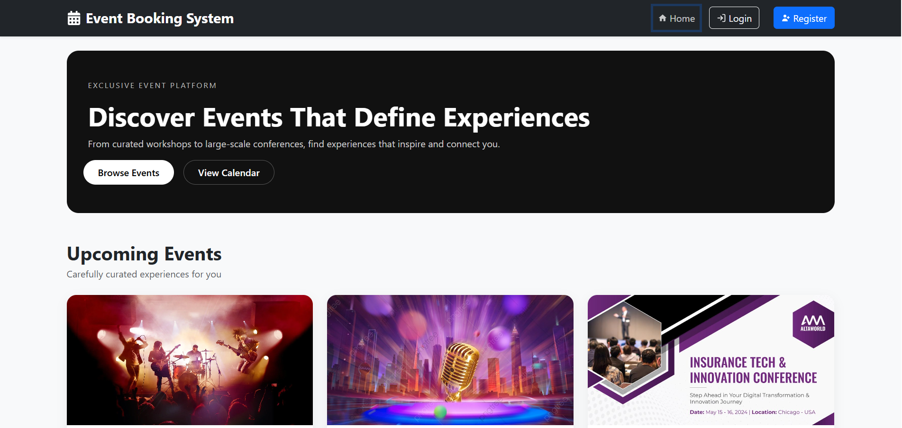

## Login Page
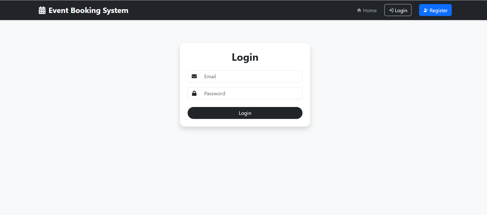

## Register Page
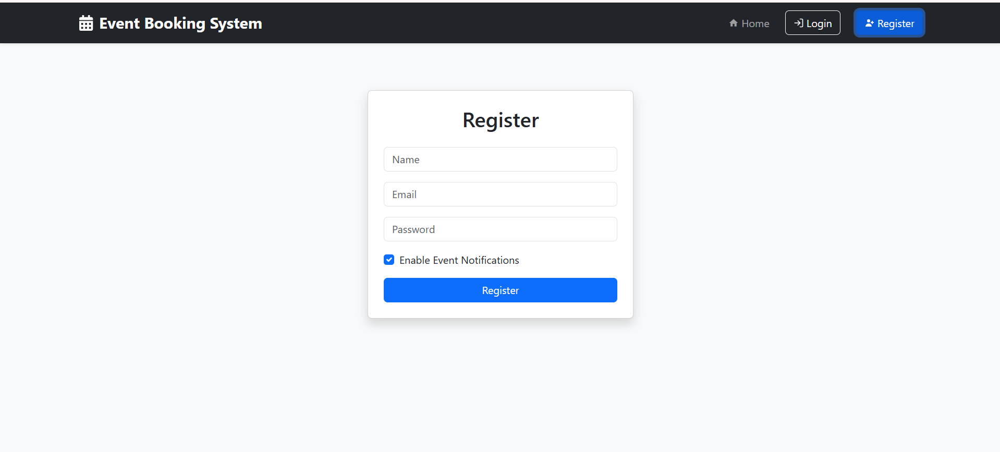

## Events Listing
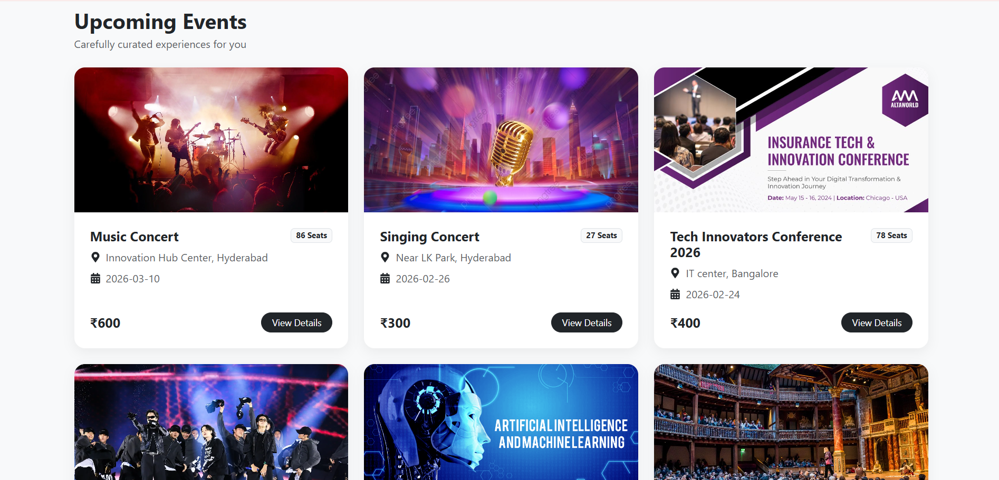

---

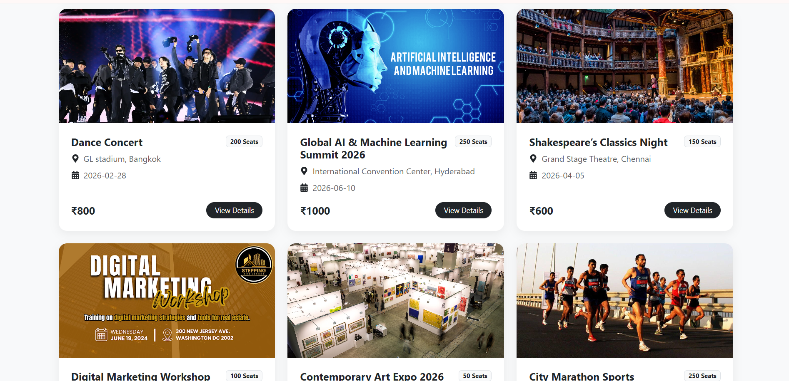

## Event Details


## Payment Page
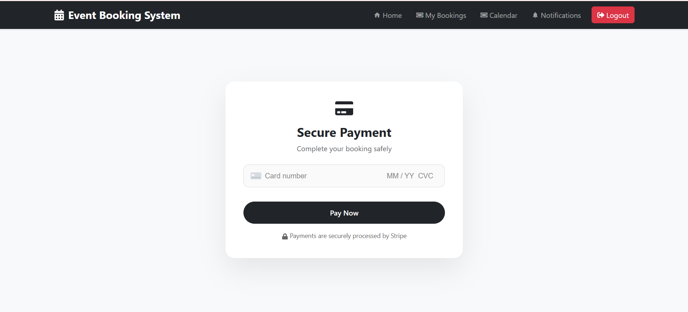

## Booking Success
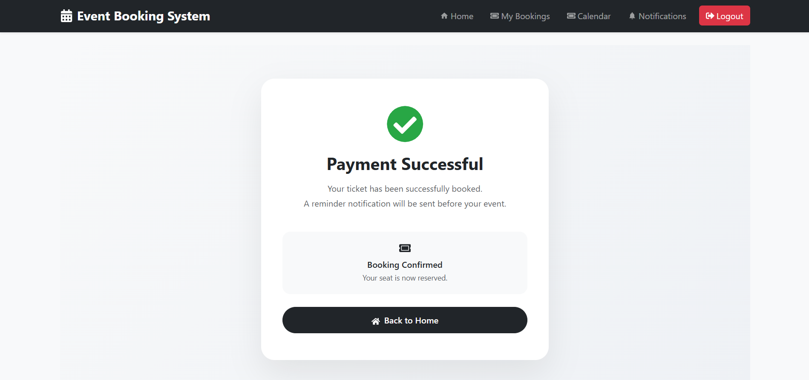

## My Bookings
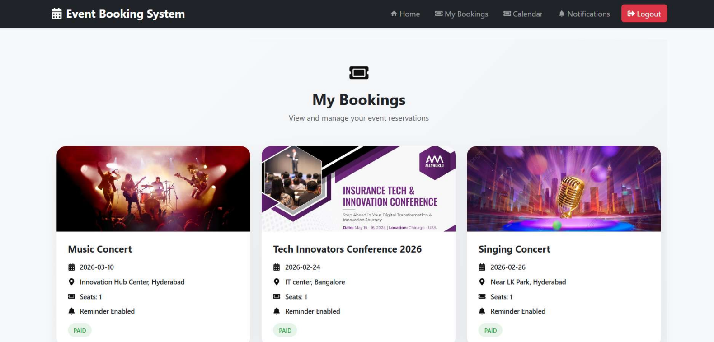

## Notifications
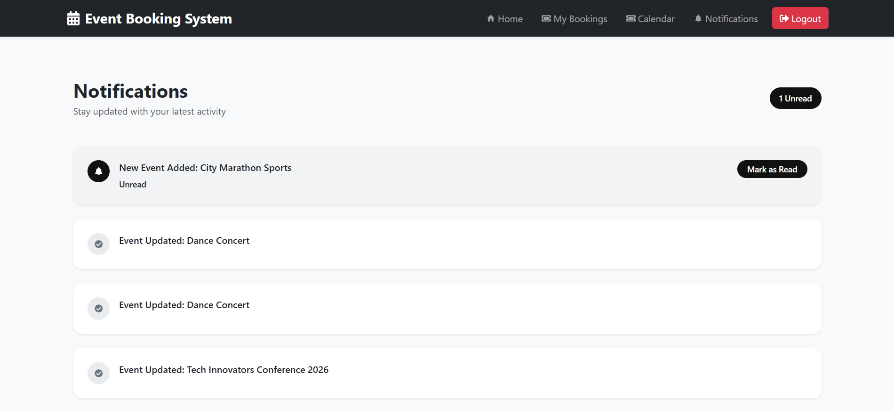

## Admin Dashboard
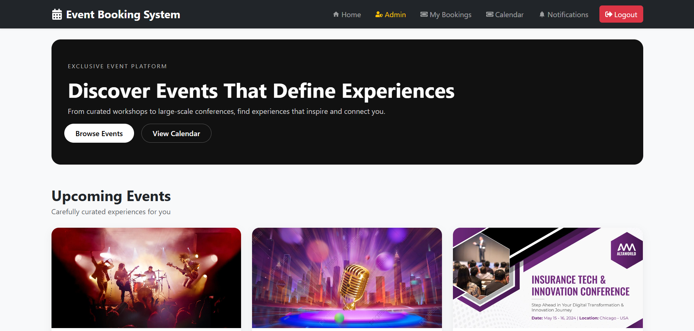

## Event Creation (Admin)
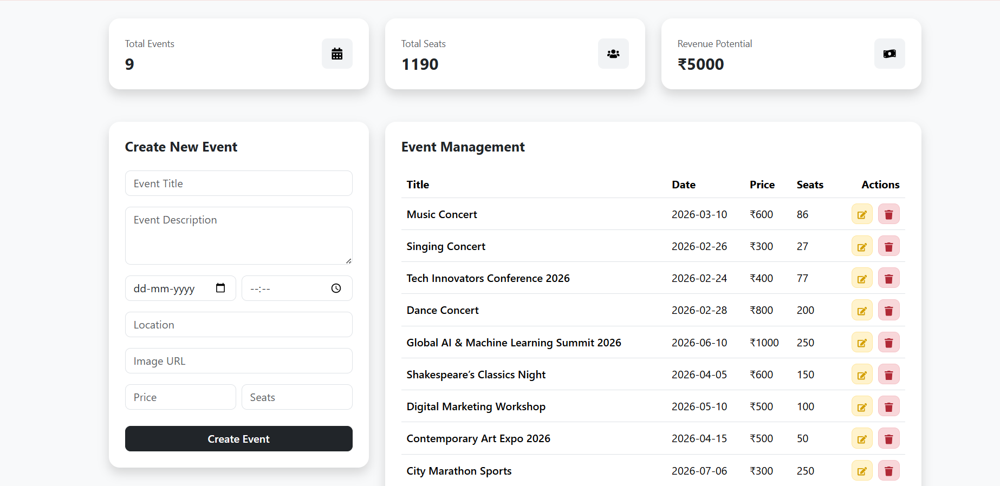

## Event Schedule
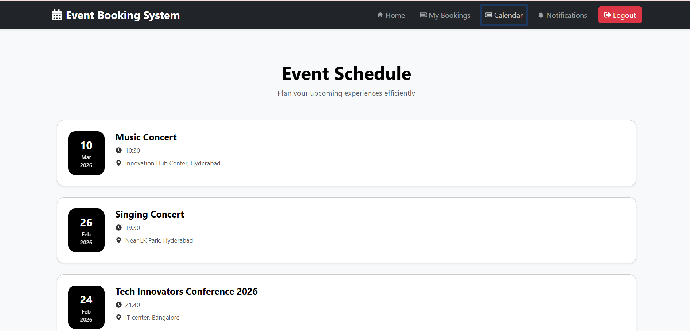

## Responsive Designs
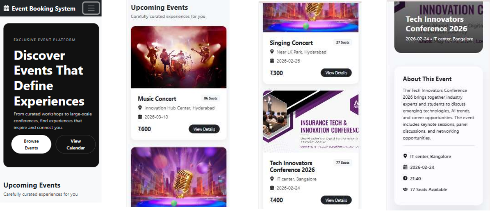

---

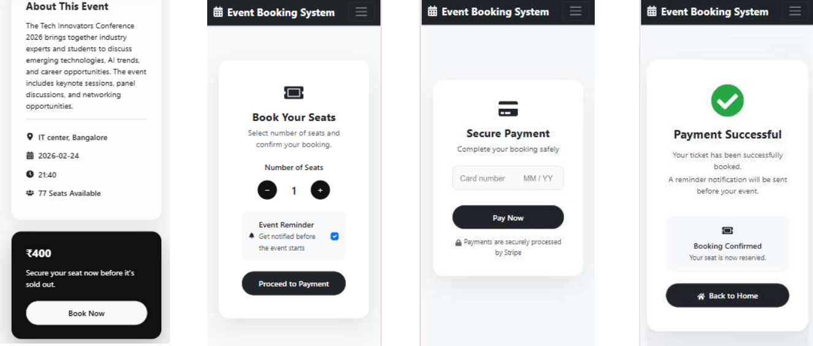

---

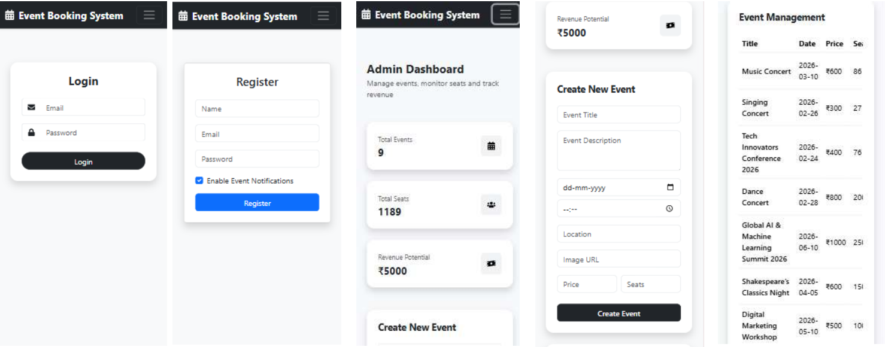

---

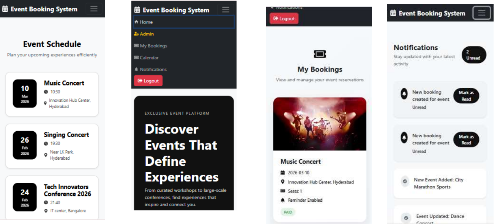

---

## **Installation & Setup**

### **Backend**
1. Navigate to the backend folder:
```bash
cd backend
```
2.Install dependencies
```bash
npm install
```
install all the dependencies mentioned in package.json file at backend folder.

3.Create a .env file
```bash
PORT=5000
MONGODB_URI=<your-mongodb-uri>
STRIPE_KEY=<your-stripe-test-key>
JWT_SECRET_KEy=mysecretkeyexample123
```
4.Start the backend server
```bash
node server.js
```
### **Frontend**
1. Navigate to the frontend folder:
```bash
cd frontend
```
2.Install dependencies:
```bash
npm install
```
3. Start the React app:
```bash
npm start
```
### Usage ###
1. Open the frontend app in a browser (usually http://localhost:3000).

2. Browse events by category.

3. Admins can log in to manage events and view bookings.

4. Users can book tickets and view confirmations.
